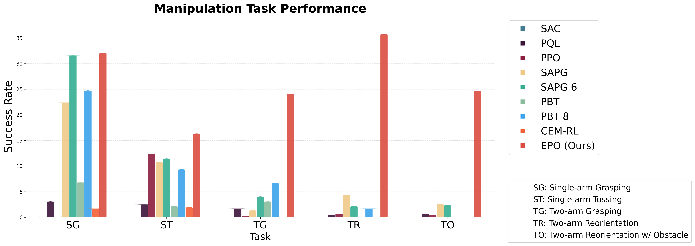

# EPO: Evolutionary Policy Optimization
[](https://arxiv.org/abs/2503.19037)
[](https://yifansu1301.github.io/EPO/)
[](https://www.python.org)
[](https://opensource.org/licenses/MIT)

This repository contains the official implementation for the algorithm **Evolutionary Policy Optimization (EPO)**. 

## Performance of EPO



## Quickstart

Clone the repository and create a Conda environment using the ```env.yaml``` file.
```bash
conda env create -f env.yaml
conda activate epo
```

Download the Isaac Gym Preview 4 release from the [website](https://developer.nvidia.com/isaac-gym) and executing the following after unzipping the downloaded file
```bash
cd isaacgym/python
pip install -e .
```

Now, in the root folder of the repository, execute the following commands,
```bash
cd rl_games
pip install -e . 
cd ..
pip install -e .
```

### Reproducing performance
 
We provide the exact commands which can be used to reproduce the performance of policies trained with EPO, SAPG, and PPO on different environments

```bash
# Allegro Kuka Regrasping
./scripts/train_allegro_kuka.sh regrasping "test" 1 24576 [] --epo --lstm --num-expl-coef-blocks=64 --wandb-entity <ENTITY_NAME> --ir-type=none  # EPO
./scripts/train_allegro_kuka.sh regrasping "test" 1 24576 [] --ppo --lstm --wandb-entity <ENTITY_NAME> # PPO

# Allegro Kuka Throw
./scripts/train_allegro_kuka.sh throw "test" 1 24576 [] --epo --lstm --num-expl-coef-blocks=64 --wandb-entity <ENTITY_NAME> --ir-type=none #EPO 
./scripts/train_allegro_kuka.sh throw "test" 1 24576 [] --ppo --lstm --wandb-entity <ENTITY_NAME> # PPO

# Allegro Kuka Reorientation
./scripts/train_allegro_kuka.sh reorientation "test" 1 24576 [] --epo --lstm --num-expl-coef-blocks=64 --wandb-entity <ENTITY_NAME> --ir-type=entropy --ir-coef-scale=0.005 #EPO
./scripts/train_allegro_kuka.sh reorientation "test" 1 24576 [] --ppo --lstm --wandb-entity <ENTITY_NAME> # PPO

# Allegro Kuka Two Arms Regrasping
./scripts/train_allegro_kuka_two_arms.sh regrasping "test" 1 24576  [] --epo --lstm --num-expl-coef-blocks=64 --wandb-entity <ENTITY_NAME> --ir-type=entropy --ir-coef-scale=0.002 # EPO
./scripts/train_allegro_kuka_two_arms.sh regrasping "test" 6 4104  [] --ppo --lstm --wandb-entity <ENTITY_NAME> # PPO

# Allegro Kuka Two Arms Reorientation
./scripts/train_allegro_kuka_two_arms.sh reorientation "test" 1 24576  [] --epo --lstm --num-expl-coef-blocks=64 --wandb-entity <ENTITY_NAME> --ir-type=entropy --ir-coef-scale=0.002 # EPO
./scripts/train_allegro_kuka_two_arms.sh reorientation "test" 6 4104  [] --ppo --lstm --wandb-entity <ENTITY_NAME> # PPO


```

## Citation
If you find our code useful, please cite our work
```
@misc{wang2025evolutionarypolicyoptimization,
      title={Evolutionary Policy Optimization}, 
      author={Jianren Wang and Yifan Su and Abhinav Gupta and Deepak Pathak},
      year={2025},
      eprint={2503.19037},
      archivePrefix={arXiv},
      primaryClass={cs.LG},
      url={https://arxiv.org/abs/2503.19037}, 
}
```
## Acknowledgements
This implementation builds upon the the following codebases - 
1. [IsaacGymEnvs](https://github.com/isaac-sim/IsaacGymEnvs)
2. [rl_games](https://github.com/Denys88/rl_games)
3. [sapg](https://github.com/jayeshs999/sapg?tab=readme-ov-file)

## References

<small><small>
<a id="1">[1]</a> 
Petrenko, A., Allshire, A., State, G., Handa, A., & Makoviychuk, V. (2023). DexPBT: Scaling up Dexterous Manipulation for Hand-Arm Systems with Population Based Training. ArXiv, abs/2305.12127.

<a id="2">[2]</a>
Schulman, J., Wolski, F., Dhariwal, P., Radford, A., & Klimov, O. (2017). Proximal Policy Optimization Algorithms. ArXiv, abs/1707.06347.

<a id="3">[3]</a>
Singla, Jayesh and Agarwal, Ananye and Pathak, Deepak. (2024). SAPG: Split and Aggregate Policy Gradients. ArXiv, abs/2407.20230.

</small></small>